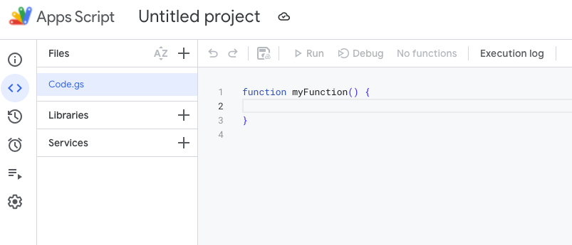
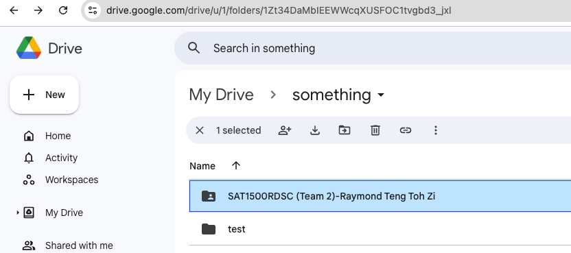

## Setting Up GDrive Helper

1. Create a google sheet
2. Launch app script project

_Figure2.1: Launch app script in your google sheet_

3. Copy [scripts](./my-google-drive.js) from this repository into your app script project. Just paste into Code.gs and save. Your project is now ready

_Figure3.1: Initial app script project. Its blank_

_Figure3.2: Pasted code into project. Saved thereafter_

4. Refresh your google sheet after project is ready.

_Figure4.1: Google sheet BEFORE refresh_

_Figure4.2: Google sheet AFTER refresh. Note the additional menu item "GDrive Helper"_

### Functionality1: Creating Subfolders

1. This functionality helps to create subfolder(s) given a base folder url
2. You need to supply 2 parameters:

- base folder url
- list of subfolders to create

3. Create a folder

_Figure3.1: Created new folder in google drive_

_Figure3.2: Get the reference URL from Chrome's address bar. Note the top of image, `https://drive.google.com/drive/...`_

4. Copy the base folder url into your google sheet. Make sure your are selecting that cell. Then, set it as `Rootfolder`.

_Figure4.1: Notice the cell selection on link, as you `Set Rootfolder`_

5. Authorisation will be needed to interact with google drive. Select `OK`

_Figure5.1: Authorisation needed to add folders to your google drive_

_Figure5.2: Permissions to grant_

6. Write pathnames you want to create within `Rootfolder`. Select the column of cells you wish to use as pathnames

_Figure6.1: Selecting cells to be used as pathnames_

_Figure6.2: Running task_

_Figure6.2: Checking level 1 subfolders created_

_Figure6.2: Checking level 2 subfolders created_

### Functionality2: Creating assignment Teams folder, grant permission, send notification email

1. This functionality helps you:

- create assignment folder for a team
- create individual folders inside team folder
- grant team folder access to relevent team members
- sent notification to all team members

2. Setting the team name

_Figure2.1: Setting folder name for team_

3. Select the block of team member details. Note: Must respect sequence of Name, Email, Position as per image below. Pay special attention to the selection box.

_Figure3.1: Selecting the entire block of student details_

4. Inspecting result of teams folder, along with its contents

_Figure4.1: Checking the result of level1 subfolder creation_

_Figure4.2: Checking the result of level2 subfolder creation_

_Figure4.3: Checking result from folder permission_

_Figure4.4: Checking result from email_
